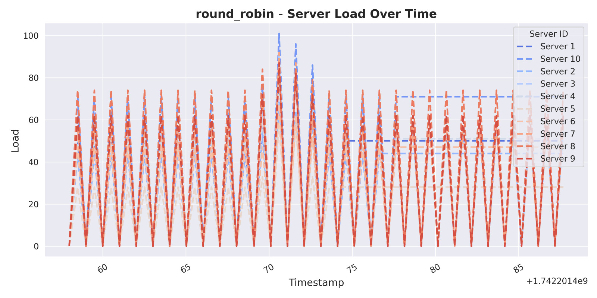
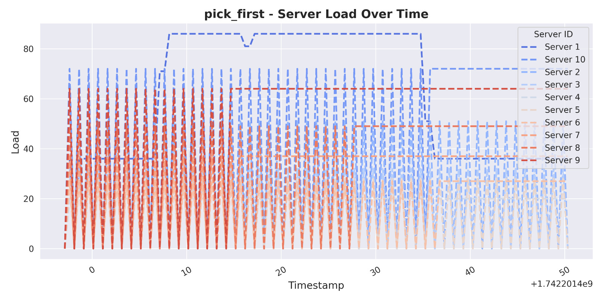
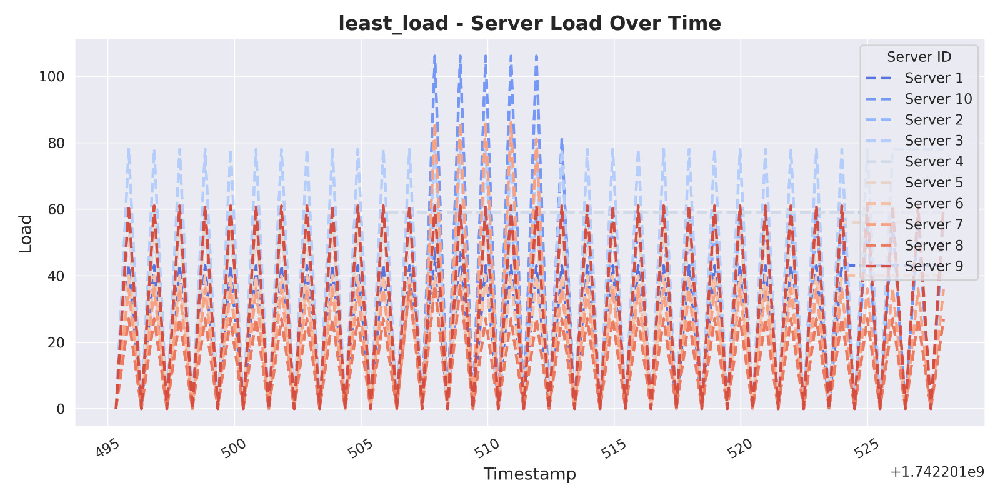
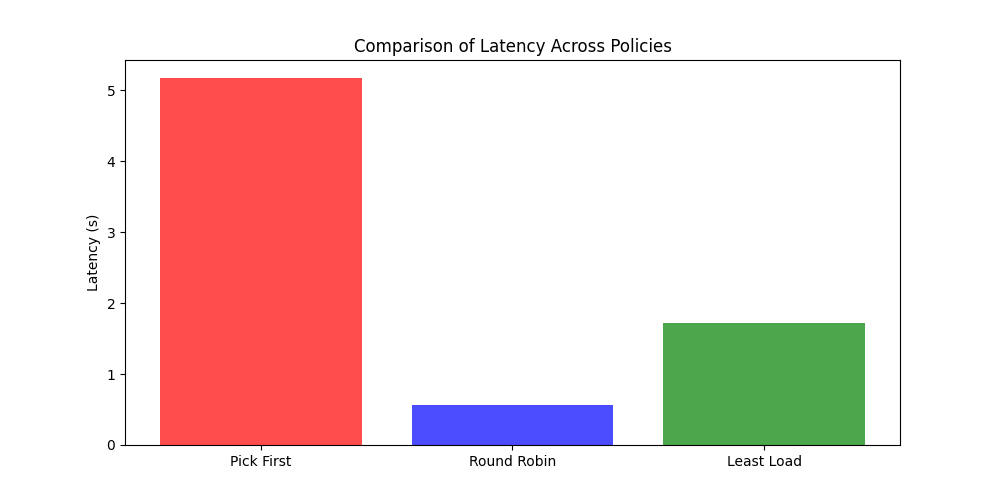
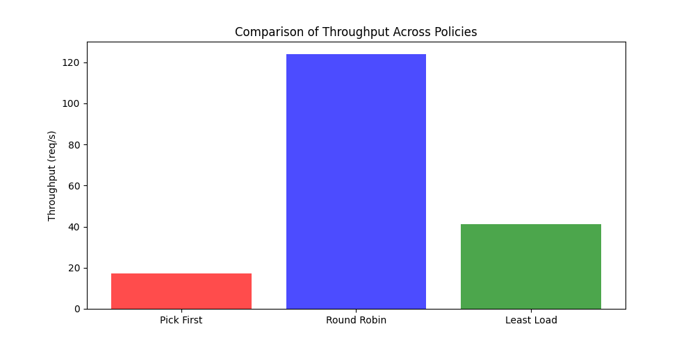

# gRPC-Based Load Balancer: Architecture and Implementation

## Introduction
This project implements a **gRPC-based load balancer** that distributes client requests among multiple backend servers. The system supports three load-balancing policies:  
- **Round Robin (RR)** – Distributes requests evenly across all available servers.  
- **Pick First (PF)** – Always assigns requests to the first available server.  
- **Least Load (LL)** – Routes requests to the server with the lowest reported CPU load.  

The implementation utilizes **gRPC for communication**, **etcd for service discovery**, and **multi-threading for concurrency**.

---

## System Components
### Load Balancer (`load_balancer_server.py`)
The **Load Balancer** manages request routing based on the chosen policy. It:  
1. **Maintains a list of active backend servers** by monitoring etcd.  
2. **Assigns requests** to servers based on the configured policy.  
3. **Receives load reports** from backend servers to optimize routing decisions.  

#### Load Balancer Policies:
- **Round Robin (RR):** Iterates over available servers in sequence.
- **Pick First (PF):** Always assigns requests to the first registered server.
- **Least Load (LL):** Routes requests to the least-loaded server (determined via reported CPU load).

---

### Backend Server (`backend_server.py`)
Each **Backend Server** processes client requests and periodically:  
- **Registers itself** with etcd.
- **Reports its CPU load** to the Load Balancer.
- **Processes incoming tasks**, either **SIMPLE** (lightweight) or **CPU_HEAVY** (computationally expensive).

#### Task Processing:
- **Simple Task:** Returns a simple response immediately.
- **CPU-Heavy Task:** Simulates a high computational workload.

---

### Client (`client.py`)
The **Client** continuously requests a server from the Load Balancer and forwards tasks to the assigned server.

---

## gRPC Services
The system defines two main **gRPC services** in `load_balancer.proto`:

###  `LoadBalancer` Service
| RPC Method          | Request Message       | Response Message       | Description |
|---------------------|----------------------|------------------------|-------------|
| `GetServer`        | `ClientRequest`      | `ServerResponse`       | Assigns a client to a backend server. |
| `ReportLoad`       | `LoadReport`         | `LoadReportResponse`   | Backend servers report their CPU load. |
| `RegisterServer`   | `ServerRegistration` | `RegistrationResponse` | Registers a new backend server (unused in this version). |

---

### `Backend` Service
| RPC Method        | Request Message | Response Message | Description |
|-------------------|----------------|------------------|-------------|
| `ProcessTask`    | `TaskRequest`   | `TaskResponse`   | Processes a client task and returns a result. |

---

## Service Discovery with etcd
- Backend servers **register themselves with etcd** under `/servers/{server_address}`.  
- The Load Balancer **watches etcd for server changes**, ensuring it has an up-to-date list of available servers.  
- Servers periodically **refresh their lease** to remain registered.  

# Round Robin  

Round Robin is one of the most widely used load-balancing algorithms, known for its simplicity and ease of implementation. Here’s how it works:  

Imagine you have two servers behind a load balancer. When the first request arrives, the load balancer forwards it to Server 1. The second request (presumably from another client) is then sent to Server 2. Since there are only two servers, the third request loops back to Server 1, the fourth to Server 2, and so on, in a continuous cycle.  

## Limitations of Round Robin  

While this method is straightforward, it has some drawbacks. Consider a scenario where Server 1 has more CPU power, RAM, and overall capacity than Server 2. Ideally, Server 1 should handle a larger share of the workload. However, a pure Round Robin algorithm doesn’t account for server capabilities—it distributes requests equally, regardless of individual server performance. This can lead to Server 2 becoming overloaded faster, potentially causing failures or downtime.  

## When to Use Round Robin  

Round Robin works best when all servers in the cluster have identical specifications. If your servers have varying capacities, you might want to explore alternative load-balancing strategies, such as **Weighted Round Robin** or **Least Connections**, which consider server load and resource availability.

### Load Distribution Analysis for Round Robin

# Pick First  

Unlike Round Robin, the **Pick First** policy doesn’t perform true load balancing. Instead, it simply selects the first available server from a list provided by the name resolver and continues using that server until it becomes unavailable.  

## How Pick First Works  
1. The client queries a name resolver (e.g., DNS) for a list of server addresses.  
2. It attempts to connect to the first address in the list.  
3. If the connection succeeds, all subsequent requests are sent to that same server.  
4. If the connection fails, it moves to the next address in the list and repeats the process.  

## Limitations of Pick First  

- **No Load Distribution:** Since all requests go to the first successful connection, other servers remain idle unless the chosen server fails.  
- **Potential Overloading:** If the first-picked server has limited capacity and high traffic, it can become overloaded while other servers remain underutilized.  
- **Failover Delays:** If the selected server becomes slow or unresponsive, there may be delays before the client switches to another server.  

## When to Use Pick First  

The Pick First policy is best suited for scenarios where:  
- A single persistent connection is sufficient (e.g., low-latency RPC calls).  
- The client doesn’t need to actively distribute requests across multiple servers.  
- The overhead of dynamic load balancing is unnecessary or undesired.  

### Load Distribution Analysis for Pick First
 

# Least Load

Least Load is a more intelligent load-balancing strategy that dynamically distributes traffic based on server utilization. Instead of blindly assigning requests, it monitors server load and directs new requests to the server with the lowest workload.  

## How It Works  

1. The load balancer continuously tracks the **current load** on each server (e.g., active connections, CPU usage, memory).  
2. When a new request arrives, it is forwarded to the server with the **least load** at that moment.  
3. As requests are processed and load fluctuates, the distribution dynamically adjusts.  

## Advantages  

- **Optimized Resource Usage:** Servers handle requests based on their real-time capacity, leading to better performance.  
- **Prevents Overloading:** Heavily loaded servers receive fewer requests, reducing the risk of failures.  
- **Adaptive Scaling:** Works well in dynamic environments where workloads are unpredictable.  

## Limitations  

- **More Overhead:** The load balancer must continuously monitor server status, which adds complexity.  
- **Latency in Decision-Making:** If load metrics are not updated frequently, decisions might be based on outdated data.  

## Best Use Case  

Least Load is ideal for systems where:  
- Servers have varying capacities.  
- Workloads fluctuate dynamically.  
- Maintaining optimal performance is critical. 

### Load Distribution Analysis for Least Load

## Comparision of Latency for Round Robin, Pick First and Least Load

## Comparision of Throughput for Round Robin, Pick First and Least Load

## Latency vs. Throughput Trade-off
- **round_robin** maximizes throughput by minimizing coordination overhead.  
- **least_load** prioritizes load distribution at the cost of some throughput to prevent server overload.  

## Load Balancing Efficiency
- **Best Load Distribution:**  
  `round_robin` (uniform spread) > `least_load` (adaptive) > `pick_first` (single server).  
- **Worst Load Distribution:**  
  `pick_first` creates a bottleneck and a single point of failure.  

## Policy Overheads
- **least_load** has minimal overhead, as servers push load updates to the load balancer (LB),  
  which makes routing decisions using in-memory data.  
- **round_robin** also has minimal overhead, supporting near-linear scaling.  

