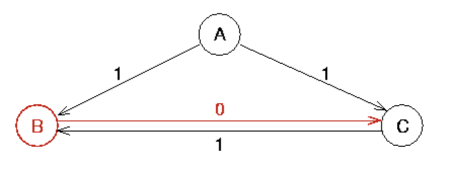
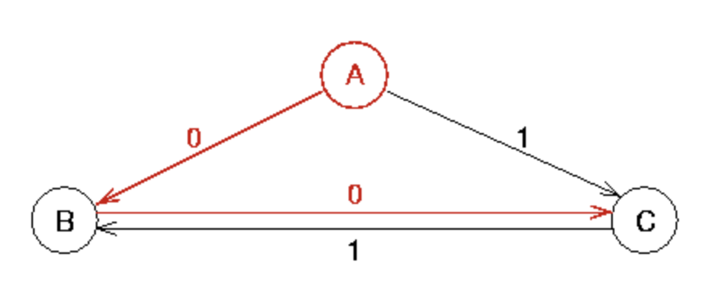
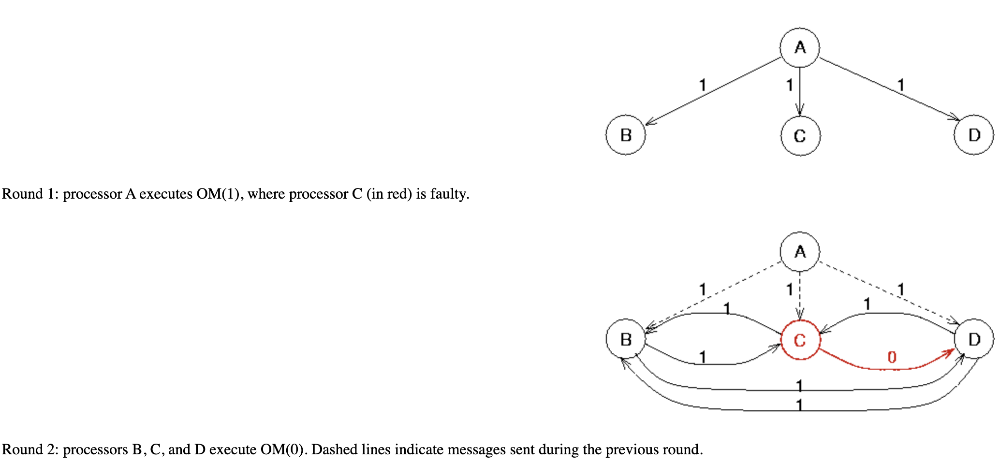
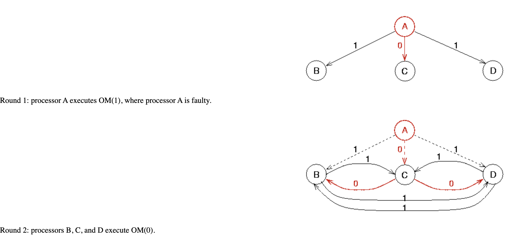

# Taxonomy of Problems

All non-faulty processors must agree on value(s) from a non-faulty processor.

## Byzantine Agreement
- The source processor broadcasts its initial value to all other processes.
- **Agreement**: All nonfaulty processors agree on the same value.
- **Validity**: If the source processor is nonfaulty, the common agreed-upon value by all nonfaulty processors should be the initial value of the source.

## Consensus
- Every processor broadcasts the initial value to all other processors.
- **Agreement**: All nonfaulty processors agree on the same value.
- **Validity**: If the initial value of every nonfaulty processor is `v`, then the agreed-upon common value by all nonfaulty processors must be `v`.

## Interactive Consistency
- Every processor broadcasts its initial value to all other processors.
- **Agreement**: All nonfaulty processors agree on the same vector `(v_1, v_2, ..., v_n)`.
- **Validity**: If the `i`-th processor is nonfaulty and its initial value is `v_i`, then the `i`-th value to be agreed on by all nonfaulty processors must be `v_i`.

Byzantine agreement is the most basic one. Algorithms to solve the other problems can be constructed from an algorithm to solve the Byzantine agreement problem, though more direct algorithms may also exist.

## Impossibility Results
- Byzantine agreement is impossible if `m > ⌊(n-1)/3⌋`
  - Example: `⌊(3-1)/3⌋ = 0`
- Byzantine agreement is impossible with `< (m+1)` message exchanges.
- We will see some algorithms for solving the Byzantine agreement problem that fall within these bounds. However, the algorithms are fairly complex. This should naturally lead one to think twice when designing a system to avoid requiring agreement.

## Example: Byzantine Agreement with 3 Processors
- Processor A initiates the agreement protocol and processor B is maliciously faulty.
  
- C sees that B has decided for `0` and A has decided for `1`. To satisfy Byzantine agreement, C must decide for `1`, since A is not faulty and A decided for `1`. This implies that the algorithm must break ties in favor of the initiating processor.
  

### Case: Processor A is a Traitor
- A reports different values to B and C.
- B thinks A decided for `0` and C thinks A decided for `1`.
- If the algorithm breaks ties in favor of the initiator, C must decide for `1`. However, B must follow the same algorithm and decide for `0`, leading to no agreement among nonfaulty processors.

## Lamport-Shostak-Pease Algorithm (No Failures)
- Solves Byzantine agreement for `n ≥ 3m+1` processors in the presence of `m` faulty processors.
- Recursively defined as `OM(m)`, where `m ≥ 0`.
- This is called the **Oral Message** algorithm, as messages are delivered orally via pairwise conversations.

### Oral Messages Properties
1. Every message that is sent is delivered exactly.
2. The receiver of a message knows who sent it.
3. The absence of a message can be detected.

### Lamport Terminology for Byzantine Agreement
- Every processor is a **general**.
- The **commander** initiates the agreement protocol.
- The **order** is the value suggested by the commander.
- The other generals are **lieutenants**.
- Faulty processors are **traitors**.
- Nonfaulty processors are **loyal**.

### OM(0, S)
- If there are no traitors, achieving agreement is straightforward:
  1. The commander `i` sends the proposed value `v` to every lieutenant `j` in `S - {i}`.
  2. Each lieutenant `j` accepts the value `v` from `i`.

### OM(m, S) for `m > 0`
1. The commander `i` sends a value `v` directly to every lieutenant `j ∈ S - {i}`.
2. For each lieutenant `j ∈ S - {i}`:
   - Let `v_j` be the value received from `i` or `RETREAT` if no value is received.
   - `j` initiates `OM(m-1, S - {i})` recursively with value `v_j`, acting as commander.
3. When Step 2 is completed:
   - Each lieutenant `j` tabulates received pairs `(k, v_k)`, one for each `k ∈ S - {i}`.
   - Agrees on `v = majority({(k, v_k) | k ∈ S - {i}})`.

## Byzantine Agreement Conditions
- **Agreement**: All loyal generals agree on the same value.
- **Validity**: If the commander is loyal, the common agreed-upon value for all loyal lieutenants is the initial one given by the commander.

## Validity Lemma
- **Lemma**: For any `m` and `k`, `OM(m, S)` satisfies the Validity Condition if there are more than `2k + m` processors and at most `k` are traitors.

### Proof by Induction
1. **Base Case**: `OM(0)` satisfies Validity Condition since all processes get the same value `v`.
2. **Inductive Step**: Assume true for `OM(m-1)`, prove for `OM(m)`.
   - Loyal commander `i` sends `v` to all other processors.
   - Each loyal lieutenant `j` applies `OM(m-1, S-{i})`.
   - Since `|S| > 2k + m`, we have `|S - {i}| > 2k + (m-1)`, ensuring agreement.
   - A majority of lieutenants in `S - {i}` are loyal, so they agree on `v`.

## Agreement Theorem
- **Theorem**: `OM(m, S)` satisfies the Validity and Agreement Conditions if `|S| > 3m` and at most `m` are traitors.

### Proof by Induction
1. **Base Case**: `OM(0)` satisfies Validity and Agreement Conditions when no traitors exist.
2. **Inductive Step**:
   - If the commander is loyal, then Agreement and Validity are satisfied.
   - If the commander is a traitor, at most `m-1` lieutenants can be traitors.
   - Since `|S| > 3m`, we have `|S - {i}| > 3(m-1)`, ensuring agreement.

# Examples

## Message Complexity
- `T(0, n) = n-1`
- `T(m, n) = (n-1)T(m-1, n-1)`, for `m > 0`
- `T(m, n) = (n-1)(n-2)(n-3)⋯(n-m-1) ≈ O(n^m)`

# Analysis of Byzantine Fault Tolerance Solution

## Overview
The implemented solution simulates the Byzantine Generals Problem using the Oral Messages (OM) algorithm, as described by Leslie Lamport. The goal is to ensure that all loyal generals agree on a common decision (e.g., "ATTACK" or "RETREAT") despite the presence of traitorous generals who may send conflicting or misleading messages.

## Key Components

- **Generals:** Each general is represented as an instance of the `General` class. Loyal generals follow the protocol, while traitors may act maliciously.
- **gRPC Communication:** Generals communicate using gRPC, ensuring reliable message passing between distributed nodes.
- **Recursive OM Algorithm:** The OM algorithm is implemented recursively to handle message propagation and decision-making.
- **Traitor Behavior:** Traitors may flip orders for even-indexed generals, introducing uncertainty into the system.

## Effectiveness of the Solution

### Strengths

#### Fault Tolerance
- The solution can tolerate up to `m` traitors, where `m` is the recursion depth of the OM algorithm.
- Loyal generals reach a consensus despite the presence of traitors, ensuring system resilience.

#### Distributed Communication
- Using gRPC for communication ensures that messages are reliably delivered between generals, even in a distributed environment.
- Each general operates independently, making the system scalable.

#### Dynamic Traitor Handling
- Traitors are dynamically identified based on their behavior (e.g., flipping orders for even-indexed generals).
- The system can adapt to different configurations of loyal and traitorous generals.

#### Recursive Decision-Making
- The OM algorithm ensures that decisions are propagated recursively, allowing generals to validate orders from multiple sources.
- This reduces the impact of malicious messages from traitors.

#### Graceful Termination
- The program ensures that all gRPC servers are shut down gracefully after the simulation completes, preventing resource leaks.

### Limitations

#### Scalability
- The OM algorithm has a message complexity of `O(n^m)`, where `n` is the number of generals and `m` is the recursion depth.
- This makes the solution less scalable for large numbers of generals or high recursion depths.

#### Traitor Detection
- The current implementation assumes that traitors flip orders for even-indexed generals. In a real-world scenario, traitors may exhibit more sophisticated behavior, making detection harder.

#### Synchronous Assumptions
- The solution assumes synchronous communication, where messages are delivered reliably and in a timely manner. In asynchronous environments, additional mechanisms (e.g., timeouts) would be needed.

#### Single Point of Failure
- The commander (General 0) initiates the algorithm. If the commander is a traitor, the system may fail to reach consensus.

#### Resource Usage
- Each general runs a gRPC server, which consumes resources (e.g., memory, CPU). For large-scale systems, this could become a bottleneck.

## Discussion

### Effectiveness in Simulated Environment
The solution effectively demonstrates Byzantine Fault Tolerance in a controlled, simulated environment:

- Loyal generals consistently reach a consensus on the commander's order.
- Traitors are unable to disrupt the consensus, as their malicious behavior is mitigated by the OM algorithm.
- The use of gRPC ensures reliable communication between generals, even in the presence of faults.

### Real-World Applicability
While the solution works well in simulation, several challenges must be addressed for real-world deployment:

#### Asynchronous Communication
- Real-world systems often experience network delays and message losses. The solution would need to incorporate mechanisms to handle asynchronous communication.

#### Dynamic Membership
- In real-world systems, generals (nodes) may join or leave the network dynamically. The solution would need to support dynamic membership changes.

#### Advanced Traitor Behavior
- Traitors in real-world systems may exhibit more complex behavior (e.g., colluding with other traitors). The solution would need to incorporate more sophisticated detection mechanisms.

#### Performance Optimization
- The OM algorithm's high message complexity makes it unsuitable for large-scale systems. Alternative BFT algorithms (e.g., Practical Byzantine Fault Tolerance, PBFT) could be explored for better scalability.
